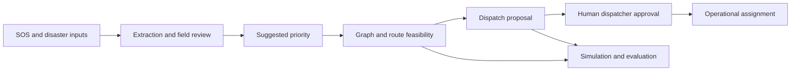

# RescueAI architecture

This document describes the repository boundaries established for [MVP Architecture v1](MVP%20Architecture%20v1.md). The current code is an MVP scaffold with an offline synthetic SOS benchmark, a dynamic road graph, and standalone one-wave dispatch strategies. The architecture document describes the intended MVP; a described workflow is not evidence that it has been implemented.

## Purpose and status

RescueAI will propose rescue team assignments and routes from SOS reports, team state, and a changing road graph. Every operational recommendation requires a human dispatcher to approve or reject it. The only live API behavior is `GET /health`. Standalone domain behavior now includes SOS contracts, synthetic benchmark tooling, deterministic road-graph routing, and four dispatch proposal strategies. SOS extraction, reviewed priority calculation, an operational approval workflow, and the end-to-end workflow remain future work.

The arrows show the planned flow. They do not represent a functioning end-to-end pipeline yet.

## Package ownership

| Path | Boundary |
| --- | --- |
| `backend/api/` | FastAPI app and HTTP schemas. Route handlers should delegate domain work. |
| `backend/domain/` | Shared Pydantic domain schemas and value contracts, independent of HTTP. |
| `backend/extraction/` | SOS text extraction interface. Model output, provenance, missing fields, and uncertainty remain explicit. |
| `backend/priority/` | Explainable *suggested* priority interface. A suggestion is not a verified fact. |
| `backend/routing/` | Implemented directed, weighted road graph, deterministic Dijkstra routes, road updates, and dispatch contract adapter. |
| `backend/dispatch/` | Shared routing/eligibility snapshot, interchangeable one-wave policies, exact assignment matching, and proposal contracts. |
| `backend/simulation/` | Seed helper; planned deterministic playback logic and simulation clock. |
| `simulation/` | Placeholder for scenario inputs and documented synthetic assumptions, separate from the simulation engine. |
| `evaluation/` | Offline SOS benchmark and variant triage, measured routing trials, and synthetic one-wave dispatch comparison and ablation. |
| `experiments/` | The 100-record synthetic SOS development sample; future versioned runs and outputs. |
| `data/sos_benchmark/natural_variants/` | Task 6 render specs and imported-variant audit and triage files, separate from source code. |
| `frontend/` | Planned React dashboard; currently documentation only. |
| `tests/` | Tests for implemented behavior and contracts. |

Domain logic belongs outside `backend/api/` so simulation and tests can invoke it without HTTP. Dispatch strategies share a `DispatchStrategy.solve(state) -> DispatchPlan` interface so the policy can change without changing a consumer. The older `DispatchPolicy.propose` protocol remains as an unwired adapter contract. Keep simulation inputs, simulation logic, metric calculations, and experimental outputs distinct.

The four [SOS Schema v1](SOS%20Schema%20v1.md) snapshots are defined in `backend/domain/sos.py` and its supporting modules. Text/image source grounding that depends on the original report is checked with `validate_extraction_against_input(extraction, source)` after both snapshots are available. This is validation of records, not an implemented extractor or priority policy.

The [Task 5 SOS generator](../evaluation/sos_benchmark/README.md) freezes latent state, planned claims, and gold before rendering text. Its deterministic, synthetic output remains the primary benchmark. The optional [Task 6 variation layer](../evaluation/sos_benchmark/natural_variants/README.md) projects only communication-plan and gold-annotation facts into a render spec. It does not read hidden latent state to form generation instructions or redefine ground truth. A stored render spec holds submitted GPS in `external_context` for local checks; `provider_payload()` omits that context. Imported text is triaged offline, and inclusion in a frozen benchmark requires independent semantic validation and re-anchored evidence.

The [road graph](../backend/routing/README.md) stores directed `backend.routing.Road` edges with distance, base travel time, nonnegative risk, status (`OPEN`, `DEGRADED`, `BLOCKED`), and a timezone-aware update timestamp. The older `backend.domain.models.RoadEdge` remains a placeholder with different fields; `Road` is authoritative for graph operations. `DynamicRoadGraph.find_route` and `apply_event` implement the existing `RoadNetwork` protocol used by future dispatch code. Dijkstra excludes blocked roads and optimizes adjusted travel time plus a caller-configured risk penalty; its returned travel time excludes that penalty. Graph revisions identify the state behind a route. Rerouting begins at an explicit graph node, while an in-flight edge is the simulation layer's responsibility. No AI model participates in path search.

## Data and decision contracts

- An SOS retains its original text, timestamp, optional image reference, and supplied location. Extracted values need provenance or uncertainty where available; unknown values remain unknown. Reports without usable locations cannot be routed.
- A rescue team has graph position, capabilities, availability, and a scenario-defined capacity. The team must define whether capacity means seats, simultaneous assignments, or another limit before using it in an algorithm.
- A road edge records endpoints, travel time, distance, risk, status, and last update time. The graph can block, unblock, replace, or remove an edge and recompute a feasible route. In the planned MVP simulation, a team already on an edge finishes it before a closure prevents new entries.
- A dispatch proposal records proposed team–SOS pairs, routes, predicted arrival times, reasons, policy identity, and approval status. Creating a proposal must not itself assign a team. Approvals and rejections are separate auditable events.
- An unreachable SOS has no fabricated route or arrival time. A zero metric must not stand in for unavailable data.

The implemented one-wave policies are FCFS, nearest feasible team, priority-aware greedy, and `RescueAIOptimizer`. They share the same `DispatchState`, graph revision, feasible routes and ETA matrix. `build_dispatch_state` requires an accepted incident routing anchor, availability, declared capability coverage, and a passable route before including a pair. The graph first selects each route by its configured effective cost (travel plus risk penalty); dispatch then assigns teams using the whole-second travel ETA of those fixed routes. It does not jointly optimize paths and assignments. Proposed arrival and response estimates retain the route's actual travel time, excluding risk penalty. Missing approved dispatch weights remain pending for review and outside the objective; they do not silently become zero-weight requests.

The [approved assignment formulation](RescueAI%20Assignment%20Model%20v1.md) minimizes `P = sum_i w_i z_i` (weighted pending loss) first, then `Q = sum_(i,j) w_i t_ij x_ij` (weighted travel seconds). With `K = 1 + sum_i w_i T_i^max`, minimizing `C = K P + Q` is equivalent for this integer one-wave problem. Baselines report the same `P`, `Q`, `K`, and `C` without claiming to minimize them. The optimizer uses exact Python-integer Hungarian matching with pending columns; this differs from the document's OR-Tools/checked-64-bit min-cost-flow implementation sketch while implementing the same stated objective. Fixed ID ordering and stable tie scans make output deterministic for identical inputs. Plans contain assignments, routes, predicted response, unserved requests, reasons, and explanations and always await human approval. See the [dispatch guide](../backend/dispatch/README.md).

The earlier [Priority Model v1](RescueAI%20Priority%20Model%20v1.md) suggested lexicographically maximizing a served vector in approved queue order. That policy can select a different assignment from minimizing weighted pending loss. The implementation follows the later, dedicated Assignment Model v1. No adapter currently converts `ValidatedSOS` and a priority assessment into a reviewed dispatch weight or accepted incident node.

## Configuration and reproducibility

Configuration comes from environment variables, with sample values in `.env.example`. `RESCUEAI_ENV` selects the application environment; `RESCUEAI_SIMULATION_SEED` is the integer seed helper for simulation code. The standalone dispatch comparison takes an explicit `--seed` and records the seed, generator and weight-policy versions, strategy names, graph snapshots, parameters, and raw per-request outputs. Replanning computation time and simulated travel time must be reported separately.

A 100-record synthetic SOS development sample is included, but it is unaudited and no extractor result is reported. Future synthetic inputs must be labeled **synthetic**. Extraction precision, recall, or F1 requires a reviewed labeled dataset and a documented scoring rule. See [Dataset card](DATASET_CARD.md).

Routing and replanning computation latency has a separate, reproducible grid
workload and [measured result file](../evaluation/results/road_graph_latency.json).
Those wall-clock numbers do not measure dispatch decisions, simulated travel,
or API latency.

The [dispatch comparison](../evaluation/README.md) is a reproducible, synthetic
single-wave counterfactual with instant simulated approval and first arrival
at the planned route time. It does not model subsequent events, operational
approvals, rescues, or outcomes. Its measured solver wall time is distinct
from predicted response time.

The generated-only [benchmark runner](../evaluation/README.md#reproducible-dispatch-benchmark)
freezes one scenario per seed and index before passing it to each selected
strategy. It saves a configuration manifest, full scenario snapshots, raw
per-strategy and per-request CSV, and a validated descriptive JSON summary.
The uniform-weight ablation changes approved dispatch weights on paired
snapshots while keeping evaluation weights fixed. A separate routing runner
retains raw timed Dijkstra, block, and replan trials. These tools are a
one-wave subset of the [proposed Evaluation Protocol v1](RescueAI%20Evaluation%20Protocol%20v1.md);
they do not implement event replay, its factorial design, or its inference
plan.

## Scope boundary

**MUST HAVE for the completed MVP:** validated SOS intake and extraction, suggested priority, feasible routing under road changes, dispatcher-reviewed proposals, baseline policies, a dashboard, and reproducible evaluation. These are acceptance targets, not claims about the scaffold.

**NICE TO HAVE:** image analysis, OpenStreetMap data and map display, larger optimization methods, and uncertainty analysis.

**POST-COMPETITION:** live emergency or hazard feeds, production identity management, forecasting, and operational deployment.

Open decisions remain the competition rules and deadline, demo area, real road data license, team capacity definition, priority rules, available AI model, and a reviewed labeled extraction dataset. Record decisions before implementing behavior that depends on them.
